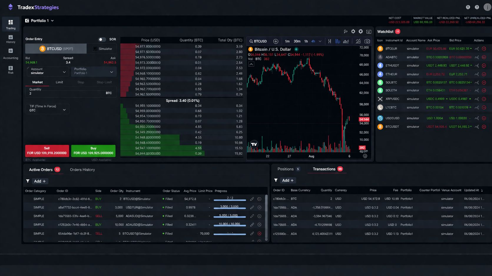

# TradexStrategies

> A professional trading strategy platform where traders discover, analyze, and deploy backtested algorithmic strategies — built for real use, not just demos.




---

## What is TradexStrategies?

TradexStrategies is a full-stack web platform that gives traders access to a curated library of 50+ backtested algorithmic strategies across Crypto, Forex, and Stocks. Two fresh strategies drop every day. Every single one is verified before it reaches your dashboard.

It's not a toy project. It has real auth, real subscriptions, a community, a native desktop app, and an admin panel — all wired up and production-ready.

---

## Why use it?

- You get strategies that are already backtested — no guesswork, no manual research
- The platform shows you equity curves, monthly returns, win/loss breakdowns, and Sharpe ratios for every strategy
- A live market ticker keeps you in sync with real-time prices across major assets
- The community hub lets traders discuss strategies, post replies, and follow each other
- There's a native desktop app (Windows available now) that works like a professional trading terminal — live charts, one-click execution, real-time alerts
- Subscription tiers (Free Trial / Premium $50 / Elite $99) unlock deeper access

---

## Key Numbers

| Metric | Value |
|--------|-------|
| Avg Annual Return | +184% |
| Win Rate | 68% |
| Max Drawdown | -8.4% |
| Sharpe Ratio | 2.31 |
| Strategies Released | 2 per day |
| Backtested Before Release | 100% |

---

## Features

- Strategy library with filters (asset class, return, win rate, risk level)
- Deep strategy detail pages — equity curves, monthly return charts, algorithm breakdown
- Live market ticker across BTC, ETH, SOL, AAPL, and more
- Community hub — threaded discussions, likes, replies, category filters, follow system
- User profiles — avatar upload, bio, trading preferences
- Subscription system — Free Trial, Premium, Elite plans
- Crypto payment flow — chain selector, wallet address, QR code, tx hash submission
- Admin panel — manage users, strategies, and payment requests
- Native desktop app — Windows download available, macOS and Linux coming
- Dark UI with emerald/violet accents throughout

---

## Tech Stack

| Layer | Technology |
|-------|-----------|
| Frontend | React 18, TypeScript, Vite, Tailwind CSS |
| UI Components | shadcn/ui, Recharts |
| Backend | Node.js, Express |
| Database | Supabase (PostgreSQL) |
| Auth | JWT |
| Deployment | Vercel (frontend + backend) |

---

## Project Structure

```
/
├── frontend/                  # React + Vite app
│   ├── src/
│   │   ├── pages/             # Dashboard, Strategies, Community, Profile, Subscription, Admin
│   │   ├── components/        # Header, StrategyCard, PaymentModal, MarketTicker, etc.
│   │   └── lib/               # API client, MetaMask utils
│   └── .env.example
│
└── backend/                   # Express REST API
    ├── src/
    │   ├── routes/            # auth, strategies, discussions, payments, follow
    │   ├── controllers/
    │   └── middleware/        # JWT auth, error handling
    └── .env.example
```

---

## Getting Started

### Prerequisites

- Node.js 18+
- A [Supabase](https://supabase.com) project

### 1. Clone the repo

```bash
git clone https://github.com/your-username/tradex-strategies.git
cd tradex-strategies
```

### 2. Backend setup

```bash
cd backend
cp .env.example .env
npm install
npm run dev        # http://localhost:3001
```

> If you need the `.env` file, please contact me.

### 3. Frontend setup

```bash
cd frontend
cp .env.example .env
npm install
npm run dev        # http://localhost:5173
```

> If you need the `.env` file, please contact me.

### 4. Database setup

Run `backend/database-setup.sql` in your Supabase SQL editor to create all required tables.

---

## Desktop App

Download the native trading terminal and get live charts, one-click strategy execution, real-time alerts, and your full strategy library in one window.

| Platform | Status |
|----------|--------|
| Windows (.exe 64-bit) | Available |
| macOS (.dmg M1/Intel) | Coming soon |
| Linux (.AppImage) | Coming soon |

---

## Deployment

Both frontend and backend are configured for Vercel out of the box.

```bash
# Deploy backend
cd backend && vercel --prod

# Deploy frontend
cd frontend && vercel --prod
```

Set environment variables in the Vercel dashboard for each project.

---

## Open Task — Crypto Payment Gateway

We're looking for a developer to wire up the full crypto payment flow. The UI and backend structure are already in place.

### What's already built

- Subscription page with Premium / Elite plan cards and Pay buttons
- `PaymentModal` component (chain selector, wallet address display, QR code, submission form)
- Admin panel UI with a Payments tab
- Supabase `users` table

### What needs to be implemented

**Database**
```sql
ALTER TABLE users
  ADD COLUMN subscription_plan TEXT DEFAULT 'free',
  ADD COLUMN subscription_expires_at TIMESTAMPTZ;

CREATE TABLE payment_requests (
  id UUID PRIMARY KEY DEFAULT gen_random_uuid(),
  user_name TEXT NOT NULL,
  user_email TEXT NOT NULL,
  plan TEXT NOT NULL,
  chain TEXT NOT NULL,
  tx_hash TEXT,
  status TEXT DEFAULT 'pending',
  created_at TIMESTAMPTZ DEFAULT now(),
  updated_at TIMESTAMPTZ DEFAULT now()
);
```

**Backend endpoints**

| Method | Route | Description |
|--------|-------|-------------|
| POST | `/api/payments/request` | Submit payment request |
| GET | `/api/payments/requests` | Admin — list all requests |
| POST | `/api/payments/requests/:id/approve` | Admin — approve & activate subscription |
| POST | `/api/payments/requests/:id/reject` | Admin — reject request |

**Payment flow**
1. User selects plan → clicks Pay
2. Modal: choose chain (20+ networks) → send crypto to wallet → submit tx hash + name + email
3. Admin reviews in panel → approves → user subscription activates in DB

**Wallet:** `0xd4062e68022ef5235898CBc4f069A0df4fF2Ea6C`  
**Plans:** Premium $50 · Elite $99

### Deliverables

- [ ] SQL migration file
- [ ] Backend payment routes fully working
- [ ] Admin approve/reject connected to DB
- [ ] Live frontend URL
- [ ] Live backend URL
- [ ] Temporary admin credentials for review

### Rules

- No hardcoded secrets
- Admin route must be protected from regular users
- Localhost screenshots will not be accepted — live deployment required

---

## License

MIT
